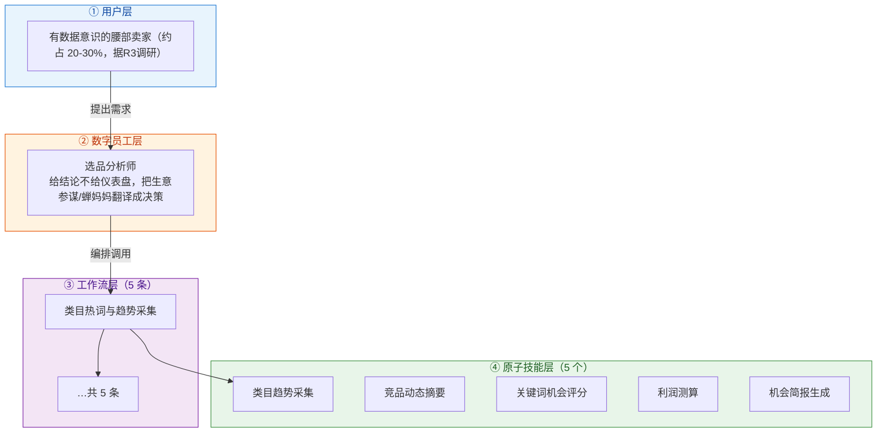
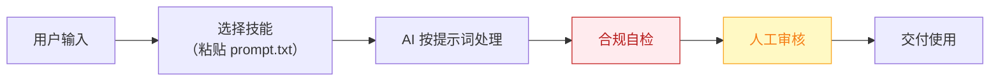

# 选品分析师 — 业务架构

## 四层视图

## 资产形态说明

本资产包为**纯提示词客户端资产**：

| 特性 | 说明 |
|------|------|
| 无运行时依赖 | 不调用任何模型 API，不需要 API Key |
| 平台无关 | 提示词为纯文本，可导入任意主流 AI 平台 |
| 用户自备算力 | 模型由用户自己的订阅提供 |
| 零服务端成本 | 资产方不产生任何调用费用 |

## 数据流

> **关键设计**：所有对外输出必须经过「合规自检 → 人工审核」双闸门。

## 能力边界

| 维度 | 内容 |
|------|------|
| **目标用户** | 有数据意识的腰部卖家（约占 20-30%，据R3调研） |
| **做** | 趋势采集、竞品监控、蓝海词挖掘、打分卡、简报 |
| **不做** | 不做：代采购、承诺"必爆" |
| **KPI** | 周报采纳率 ≥60%；选中款 30 天动销率 ≥50%；竞品异动推送 ≤2 小时 |
| **定价** | 50-150 元/月 |

---

*本图由 build_p0_assets.py 自动生成*
