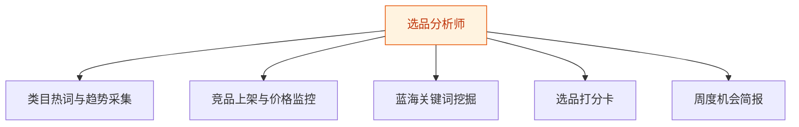
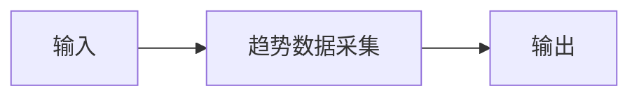
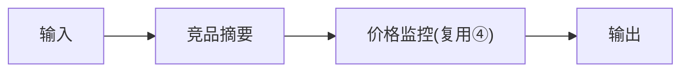
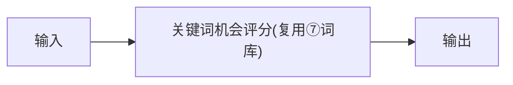
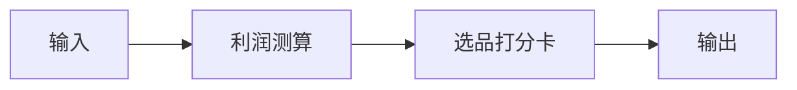
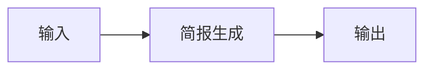

# 选品分析师 — 工作流流程图

本员工共 **5 条工作流**，下辖 **5 个原子技能**。

## 总览

## 分条详情

### 类目热词与趋势采集

| 项目 | 内容 |
|------|------|
| 触发 | 定时（每日） |
| 复杂度 | `M` |
| 阶段 | `P1` |
| ROI | 月省盯盘 10h≈¥300 |

### 竞品上架与价格监控

| 项目 | 内容 |
|------|------|
| 触发 | 定时（每 2 小时） |
| 复杂度 | `M` |
| 阶段 | `P1` |
| ROI | 跟款窗口从周级缩到小时级 |

### 蓝海关键词挖掘

| 项目 | 内容 |
|------|------|
| 触发 | 定时（每周） |
| 复杂度 | `S` |
| 阶段 | `P1` |
| ROI | 避开同质化价格战（P8） |

### 选品打分卡

| 项目 | 内容 |
|------|------|
| 触发 | 人工 |
| 复杂度 | `S` |
| 阶段 | `P1` |
| ROI | 一次错误选品压货损失数千元 |

### 周度机会简报

| 项目 | 内容 |
|------|------|
| 触发 | 定时（周一） |
| 复杂度 | `S` |
| 阶段 | `P1` |
| ROI | 月省调研整理 12h≈¥360 |

## 汇总表

| # | 工作流 | 阶段 | 复杂度 | 触发 | 涉及技能数 |
|---|--------|------|--------|------|-----------|
| 1 | 类目热词与趋势采集 | `P1` | `M` | 定时（每日） | 1 |
| 2 | 竞品上架与价格监控 | `P1` | `M` | 定时（每 2 小时） | 2 |
| 3 | 蓝海关键词挖掘 | `P1` | `S` | 定时（每周） | 1 |
| 4 | 选品打分卡 | `P1` | `S` | 人工 | 2 |
| 5 | 周度机会简报 | `P1` | `S` | 定时（周一） | 1 |

---

*本图由 build_p0_assets.py 自动生成*
