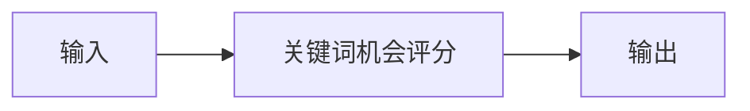

# 蓝海关键词挖掘

## 元信息

| 字段 | 值 |
|------|-----|
| ID | `de_ecom_06_wf03` |
| 类型 | **`composite`（复合技能）** |
| 所属员工 | 选品分析师 |
| 阶段 | `P1` |
| 复杂度 | `S` |
| 触发方式 | 定时（每周） |
| ROI | 避开同质化价格战（P8） |
| 资产形态 | 提示词编排 + Python 编排脚本（`scripts/run_flow.py`，仅标准库） |

> 复合技能 = 工作流。它把多个**原子技能**按业务顺序编排在一起，完成一个完整场景。

## 能力描述

1. **S1 关键词机会评分**：维度A=min(100,搜索量/700) 权重 0.6、维度B=100-竞争度 权重 0.4，总分分层（≥60 A / 45~60 B / <45 C），降序排列
2. **S2 蓝海挖掘**：竞争度 < 40 且总分 ≥ 45 标「蓝海候选」；A 层但竞争度 ≥ 70 加「红海警示」；输出 TOP3 与数值依据
3. **S3 汇总交付**：执行摘要 + 评分明细 + TOP3 表；蓝海口径显式声明且注明非唯一正解；入场决策转「利润测算」与人工确认

## 编排的原子技能

| # | 原子技能 | 能力 |
|---|---------|------|
| 1 | [关键词机会评分](../../skills/keyword-opportunity-score/) | 搜索量×竞争度→机会分 |

## 步骤链路（DAG）



## 步骤明细

| # | 步骤 | 技能资产 | 输入 | 输出 | 失败处理 |
|---|------|---------|------|------|---------|
| 1 | 关键词机会评分 | [`../../skills/keyword-opportunity-score/`](../../skills/keyword-opportunity-score/) | 上一步输出 | 关键词机会评分 输出 | 记录错误并中止 |

## 步骤说明

搜索量/竞争度→机会评分

## 输入规格

| 字段 | 类型 | 必填 | 说明 |
|------|------|------|------|
| `input` | string / object | ✅ | 工作流初始输入，由触发条件提供 |

## 输出规格

| 字段 | 类型 | 说明 |
|------|------|------|
| `summary` | string | 执行摘要 |
| `steps` | string | 分步结果 |
| `deliverable` | string | 最终交付物 |

## 错误处理

| 情况 | 处理方式 |
|------|---------|
| 输入缺失 | 提示缺少的字段，终止流程 |
| 中间步骤输出不合规 | 合规技能拦截，返回修改建议，不继续下游 |
| 提示词被平台截断 | 拆分任务，分两次处理 |

## 验收标准

- [ ] 每一步的技能资产齐全（SKILL.md / prompt.txt / schema.json）
- [ ] 步骤间输入输出字段可衔接
- [ ] 末步输出带 AI 生成标识
- [ ] 全流程有人工确认环节

## 在平台上的编排方式

| 平台 | 编排方式 |
|------|---------|
| **Coze / 扣子** | 新建工作流 → 按步骤添加节点，每个节点填入对应技能的 prompt.txt |
| **Dify** | 新建 Workflow → 添加 LLM 节点链，按 DAG 顺序连接 |
| **WorkBuddy** | 新建 Skill，按步骤在指令中串联各技能提示词 |
| **手动使用** | 按步骤顺序，逐个把 prompt.txt 与上一步输出交给 AI |

## 使用示例

```text
第 1 步：把「关键词机会评分」的 prompt.txt 粘贴到 AI，
         提供输入数据，得到输出 A。

第 2 步：把「下一技能」的 prompt.txt 粘贴到新的对话，
         把输出 A 作为输入，得到输出 B。

…依次类推，直到末步。
```

## 使用步骤

### 方式一：纯提示词编排（跨平台）

1. 把 `prompt.txt` 全文粘贴为系统提示词
2. 提供候选关键词记录（关键词 搜索量X/周 竞争度Y）与评分口径
3. 按 S1 评分 → S2 蓝海挖掘 → S3 汇总得到候选清单
4. S1/S2 的分数与标记用下方脚本实测，不靠模型口算

### 方式二：带脚本（端到端产物）

```bash
python scripts/run_flow.py --input input.json --outdir out
python scripts/run_flow.py --demo
```

| 平台 | 编排方式 |
|------|---------|
| **Coze / 扣子** | S1 节点填技能 prompt.txt，S2 挖掘用代码节点跑脚本 |
| **Dify** | Workflow → LLM 节点 + 代码节点 |
| **WorkBuddy** | 新建 Skill 按 prompt.txt 步骤串联 |

## 边界（不做的事）

- ❌ 不编造搜索量、竞争度或分数；不虚构关键词
- ❌ 不把「蓝海候选」表述为「稳赚」「必火」——不承诺销量或利润
- ❌ 不用模型口算替代脚本计算
- ❌ 不执行或建议任何绕过平台规则的操作（如刷搜索量）
- ❌ 不涉及资金操作或代替用户做最终决策

## 调用示例

**输入**（`examples/input.json`）：家居收纳类目 6 个候选关键词
（搜索量 15,000～65,000/周，竞争度 18～78）+ 缺省评分口径声明。

**输出**（脚本实跑）：S1 评分 6 条，A层 2 条（TOP1 宠物自动喂食器 64.5 分，
竞争度 78 触发红海警示）；S2 标记蓝海候选 3 个（折叠收纳箱、免打孔毛巾架、
车载收纳箱，均值竞争度 25.0）。明细落 `out/flow_scores.csv`，
报告落 `out/flow_report.md`。

## 所属工作流

本资产为复合技能（工作流），是独立的端到端流程；上游可接
`category-hotword-trend-flow`（热词采集），下游可接
`product-scoring-card-flow`（选品打分卡）。

## 合规声明

- 输出标注「AI 生成内容」，交付前必须经人工审核
- 搜索量与竞争度仅取自平台官方口径或用户粘贴数据，不爬取私域数据
- 评分与蓝海口径属策略假设，不构成入场或投资建议

---

*本复合技能定义由 build_p0_assets.py 生成*
