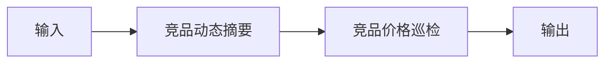

# 竞品上架与价格监控

## 元信息

| 字段 | 值 |
|------|-----|
| ID | `de_ecom_06_wf02` |
| 类型 | **`composite`（复合技能）** |
| 所属员工 | 选品分析师 |
| 阶段 | `P1` |
| 复杂度 | `M` |
| 触发方式 | 定时（每 2 小时） |
| ROI | 跟款窗口从周级缩到小时级 |
| 资产形态 | 提示词编排 + Python 编排脚本（`scripts/run_flow.py`，仅标准库） |

> 复合技能 = 工作流。它把多个**原子技能**按业务顺序编排在一起，完成一个完整场景。

## 能力描述

1. **S1 竞品动态摘要**：条目五类归组（价格调整 / 新品上架 / 促销活动 / 流量投放 / 其他），频次与店铺动作数统计，频次合计 = 条目总数
2. **S2 竞品价格巡检**：抽取降价 / 回升 / 新品定价 / 低开四类价格事件，变化% 保留 1 位小数，跌幅 ≤ -8% 标「🔴 预警」，按商品汇总观测价格带
3. **S3 汇总交付**：执行摘要 + 价格事件明细 + 价格带表；预警只到「建议人工确认」，跟价决策由人工结合利润测算确认

## 编排的原子技能

| # | 原子技能 | 能力 |
|---|---------|------|
| 1 | [竞品动态摘要](../../skills/competitor-digest/) | 竞品动态→一句话异动 |
| 2 | [竞品价格巡检](https://github.com/bangwozuo/multi-shop-ops-zh/tree/main/skills/competitor-price-patrol/)（跨仓技能） | 竞品价格/促销异动检测 |

## 步骤链路（DAG）



## 步骤明细

| # | 步骤 | 技能资产 | 输入 | 输出 | 失败处理 |
|---|------|---------|------|------|---------|
| 1 | 竞品动态摘要 | [`../../skills/competitor-digest/`](../../skills/competitor-digest/) | 上一步输出 | 竞品动态摘要 输出 | 记录错误并中止 |
| 2 | 竞品价格巡检 | [`https://github.com/bangwozuo/multi-shop-ops-zh/tree/main/skills/competitor-price-patrol/`](https://github.com/bangwozuo/multi-shop-ops-zh/tree/main/skills/competitor-price-patrol/) | 上一步输出 | 竞品价格巡检 输出 | 记录错误并中止 |

## 步骤说明

竞品动态→异动摘要推送

## 输入规格

| 字段 | 类型 | 必填 | 说明 |
|------|------|------|------|
| `input` | string / object | ✅ | 工作流初始输入，由触发条件提供 |

## 输出规格

| 字段 | 类型 | 说明 |
|------|------|------|
| `summary` | string | 执行摘要 |
| `steps` | string | 分步结果 |
| `deliverable` | string | 最终交付物 |

## 错误处理

| 情况 | 处理方式 |
|------|---------|
| 输入缺失 | 提示缺少的字段，终止流程 |
| 中间步骤输出不合规 | 合规技能拦截，返回修改建议，不继续下游 |
| 提示词被平台截断 | 拆分任务，分两次处理 |

## 验收标准

- [ ] 每一步的技能资产齐全（SKILL.md / prompt.txt / schema.json）
- [ ] 步骤间输入输出字段可衔接
- [ ] 末步输出带 AI 生成标识
- [ ] 全流程有人工确认环节

## 在平台上的编排方式

| 平台 | 编排方式 |
|------|---------|
| **Coze / 扣子** | 新建工作流 → 按步骤添加节点，每个节点填入对应技能的 prompt.txt |
| **Dify** | 新建 Workflow → 添加 LLM 节点链，按 DAG 顺序连接 |
| **WorkBuddy** | 新建 Skill，按步骤在指令中串联各技能提示词 |
| **手动使用** | 按步骤顺序，逐个把 prompt.txt 与上一步输出交给 AI |

## 使用示例

```text
第 1 步：把「竞品动态摘要」的 prompt.txt 粘贴到 AI，
         提供输入数据，得到输出 A。

第 2 步：把「竞品价格巡检」的 prompt.txt 粘贴到新的对话，
         把输出 A 作为输入，得到输出 B。

…依次类推，直到末步。
```

## 使用步骤

### 方式一：纯提示词编排（跨平台）

1. 把 `prompt.txt` 全文粘贴为系统提示词
2. 提供一周竞品监控原始条目（[序号] 日期 店铺 商品 描述）
3. 按 S1 摘要 → S2 巡检 → S3 汇总得到预警表
4. S2 的变化% 与预警用下方脚本实测，不靠模型口算

### 方式二：带脚本（端到端产物）

```bash
python scripts/run_flow.py --input input.json --outdir out
python scripts/run_flow.py --demo
```

| 平台 | 编排方式 |
|------|---------|
| **Coze / 扣子** | S1 节点填技能 prompt.txt，S2 巡检用代码节点跑脚本 |
| **Dify** | Workflow → LLM 节点 + 代码节点 |
| **WorkBuddy** | 新建 Skill 按 prompt.txt 步骤串联 |

## 边界（不做的事）

- ❌ 不编造竞品动作、价格、榜单位次；不虚构价格事件
- ❌ 不建议「必须跟价」——跟价决策由人工结合利润测算确认
- ❌ 不抓取需登录的私域数据，不绕过平台风控
- ❌ 不用模型口算替代脚本计算
- ❌ 不涉及资金操作或代替用户做最终决策

## 调用示例

**输入**（`examples/input.json`）：5 家竞品店铺 2026-09-29～10-05 的 8 条监控
条目，要求关注折叠收纳箱 69-79 元与暖风机 89-99 元价格带。

**输出**（脚本实跑）：S1 将 8 条归入 3 类（价格调整为主簇）；S2 识别 5 起
价格事件，其中 2 起触发 🔴 预警（店铺A 折叠收纳箱 79→69 元、-12.7%；
店铺C 暖风机开售 89 元、比预售价低 10 元、-10.1%）。价格事件落
`out/flow_price_events.csv`，报告落 `out/flow_report.md`。

## 所属工作流

本资产为复合技能（工作流），是独立的端到端流程；预警条目可转接
`product-scoring-card-flow`（选品打分卡）做跟价后的利润重算。

## 合规声明

- 输出标注「AI 生成内容」，交付前必须经人工审核
- 竞品信息仅限公开渠道与用户粘贴材料，不爬取需登录的私域数据
- 预警不构成跟价或采购建议；涉及资金的动作保留人工确认

---

*本复合技能定义由 build_p0_assets.py 生成*
